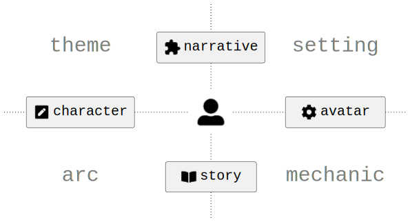
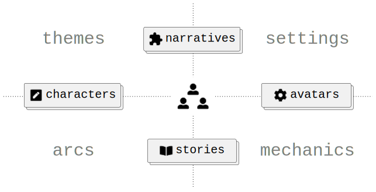
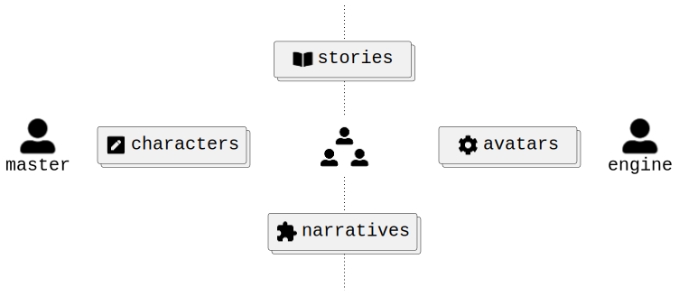

# Полновесная модель

## Система координат

Проведем горизонтальную ось через игрока. Левую полуось интерпретируем как _абстрактное_. Правую - как _конкретное_. Проведем вертикальную ось через игрока. Нижнюю полуось интерпретируем как _поведение_. Верхнюю - как _состояние_. В итоге получим систему координат, где по оси X дуальность абстрактное-конкретное, а по оси Y дуальность поведение-состояние.

    

Конкретное может представлять что-то абстрактное. Абстрактное может быть представлено чем-то конкретным. Например, число 5 может быть представлено пятью конкретными яблоками. Мы можем передать яблоки соседу, но проделать что-то подобное с числом 5 у нас не получится. С другой стороны, мы можем перевести число 5 в другую систему счисления, но проделать что-то подобное с яблоками нам не удастся.

    

Состояние может меняться при исполнении некоторого поведения. Поведение может меняться при достижении некоторого состояния. Например, в магазине мы исполняем поведение покупателя, меняя состояние корзины с продуктами. При заполнении корзины необходимыми продуктами наше поведение меняется и мы отправляемся на кассу для оплаты.

    

## Интерпретации

Четверть абстрактное-состояние интерпретируем как _тему_[^1], четверть конкретное-состояние - как _сеттинг_[^1], четверть абстрактное-поведение - как _арку_[^2] и четверть конкретное-поведение - как _механику_ [^2].

    

 

Представим игру, в которой все предопределено заранее. На стыке темы и арки автором закладывается _персонаж_, на стыке сеттинга и механики - _аватар_, на стыке темы и сеттинга - _нарратив_, на стыке арки и механики - _история_. В такой игре игрок выступает пассивным зрителем. А теперь представим игру, в которой, наоборот, все возникает в ходе игровой партии. На стыке темы и арки игроком генерируется _персонаж_, на стыке сеттинга и механики - _аватар_, на стыке темы и сеттинга - _нарратив_, на стыке арки и механики - _история_. В такой игре игрок выступает активным соавтором. Обе крайности в чистом виде встретить невозможно. Обычно что-то предопределено заранее, а что-то генерируется в процессе игры.

    

До сих пор мы рассматривали простейший случай, когда все элементы игры представлены в единственном экземпляре. Это очередная крайность, которая не встречается в чистом виде. В общем случае игра масштабируется либо вширь, либо вглубь. Масштабирование в ширину (количественное) - это добавление новых отдельностоящих элементов, например, больше независимых игроков, больше независимых персонажей, больше альтернативных механик и т.п. Масштабирование в глубину (качественное) - это добавление новых составных элементов или, другими словами, расширение способов композиции элементов, например, объединение игроков в команды, объединение персонажей в группы, построение механических комбо и т.п.

    

Осталось немного уточнить порядок взаимодействия игроков с мастером и движком. Мастер через персонажа принимает запросы по поводу намерений. Движок через аватара принимает команды по поводу действий. В свою очередь, игрок получает обратную связь через события в истории и/или нарративные эффекты[^3].

    

## Резюме

Любую игру можно разложить на "спектральные" составляющие: абстрактное, конкретное, поведение и состояние. Все остальные элементы игры получаются "смешением" базовых. Тема является результатом "смешения" состояния и абстрактного, сеттинг - состояния и конкретного, арка - поведения и абстрактного, механика - поведения и конкретного. Персонаж является результатом "смешения" темы и арки, аватар - сеттинга и механики, нарратив - темы и сеттинга, история - арки и механики. Элементы игры могут предопределяться заранее, а могут генерироваться на лету. Игра масштабируется добавлением новых отдельностоящих элементов или расширением вариантов комбинирования существующих. Персонаж и аватар являются "проводниками" намерений и действий соответственно. История и нарратив являются "проводниками" событий и эффектов соответственно.

## Указатель

Ссылки на внешние источники.

### Понятия

Ссылки на определения, объяснения или близкие по смыслу употребления.

#### Персонаж

- Шелл `Геймдизайн. Как создать игру, в которую будут играть все`
    - Глава 18, метод непрямого контроля 5.
    - Глава 20.
- Grouling `The Creation of Narrative in Tabletop Role-Playing Games`
    - Grouling использует термин _character_ на протяжении всей книги.
- Fullerton `Game Design Workshop`
    - Chapter 4, section `Character`.

#### Аватар

- Шелл `Геймдизайн. Как создать игру, в которую будут играть все`
    - Глава 20, раздел `Аватар`.
- Sellers `Advanced Game Design: A Systems Approach`
    - Chapter 3, section `The Player as Part of a Larger System`. Sellers существенно расширяет понятие аватара.

#### Нарратив

- Grouling `The Creation of Narrative in Tabletop Role-Playing Games`
    - Подробное исследование нарратива вообще и нарратива, генерируемого в реальном времени, в частности.
- Sellers `Advanced Game Design: A Systems Approach`
    - Chapter 3, section `Narrative`.
    - Chapter 4, section `Narrative and Interactive Engagement`.
- Sylvester `Designing Games: A Guide to Engineering Experiences`
    - Chapter 4.

#### История

- Шелл `Геймдизайн. Как создать игру, в которую будут играть все`
    - Глава 17.
- Grouling `The Creation of Narrative in Tabletop Role-Playing Games`
    - Grouling использует термин _story_ на протяжении всей книги.

#### Намерение

- Шелл `Геймдизайн. Как создать игру, в которую будут играть все`
    - Глава 18, метод непрямого контроля 2. Шелл использует термин _цель_.
    - Глава 20, раздел `Создание привлекательных игровых персонажей`
        - Совет 1. Шелл использует термин _функция_.
        - Совет 2. Шелл использует термин _черта_.
- Grouling `The Creation of Narrative in Tabletop Role-Playing Games`
    - Chapter 5, section `The Social Frame`. Grouling использует термин _narrative planning speech_.
    - Chapter 5, section `The Game Frame`. Grouling использует термин _statement of intention_.

#### Действие

- Шелл `Геймдизайн. Как создать игру, в которую будут играть все`
    - Глава 12, механика 4.
- Grouling `The Creation of Narrative in Tabletop Role-Playing Games`
    - Grouling использует термин _action_ на протяжении всей книги.

#### Эффект

- Sellers `Advanced Game Design: A Systems Approach`
    - Chapter 8, section `Providing Feedback`.

#### Событие

- Grouling `The Creation of Narrative in Tabletop Role-Playing Games`
    - Chapter 1, section `Cybertext: A Model for Adventure Games`.

#### Тема

- Шелл `Геймдизайн. Как создать игру, в которую будут играть все`
    - Глава 6.
- Sellers `Advanced Game Design: A Systems Approach`
    - Chapter 3, section `Architecture and Thematic Elements`.
    - Chapter 3, section `Theme, Experience, and Meaning`.
- Swink `Game Feel: A Game Designer's Guide to Virtual Sensation`
    - Chapter 5, section `Metaphor`.

#### Арка

- Шелл `Геймдизайн. Как создать игру, в которую будут играть все`
    - Глава 20, раздел `Создание привлекательных игровых персонажей`
        - Совет 8. Шелл использует термин _трансформация_.
- Fullerton `Game Design Workshop`
    - Chapter 4, section `The Dramatic Arc`.
    - Chapter 11, section `Progress`.
- Sellers `Advanced Game Design: A Systems Approach`
    - Chapter 4, section `Narrative and Interactive Engagement`. Sellers ссылается на [работу](https://lostgarden.com/2012/04/30/loops-and-arcs) Даниэля Кука.
- Sylvester `Designing Games: A Guide to Engineering Experiences`
    - Chapter 1, section `Emotion Through Character Arcs`.

#### Сеттинг

- Шелл `Геймдизайн. Как создать игру, в которую будут играть все`
    - Глава 19. Шелл использует термин _трансмедийный мир_.
- Grouling `The Creation of Narrative in Tabletop Role-Playing Games`
    - Chapter 4, section `Campaign Settings in D&D`.

#### Механика

- Шелл `Геймдизайн. Как создать игру, в которую будут играть все`
    - Глава 12.
- Sellers `Advanced Game Design: A Systems Approach`
    - Chapter 3, section `Structural Elements and Game Mechanics`.
    - Chapter 7, section `Game Mechanics`.
- Swink `Game Feel: A Game Designer's Guide to Virtual Sensation`
    - Chapter 4, section `Mechanics: Game Feel Atoms`.

#### Мастер

- Шелл `Геймдизайн. Как создать игру, в которую будут играть все`
    - Глава 18, метод непрямого контроля 5. Шелл предлагает контролировать персонажа игрока через других персонажей.
- Grouling `The Creation of Narrative in Tabletop Role-Playing Games`
    - Grouling использует термин _dungeon master_ (DM) на протяжении всей книги.

#### Движок

- Sellers `Advanced Game Design: A Systems Approach`
    - Chapter 7, section `Engines`.

#### Геймлэнг

- Wehrle [Game Design Workshops](https://www.youtube.com/playlist?list=PLNOeNKnzorF5BsM8Rwm3WouPvChzBh2-h)
    - Видео `Game Design as Process`, минута 20. Wehrle использует термин _грамматика_.
- Grouling `The Creation of Narrative in Tabletop Role-Playing Games`
    - Chapter 5, section `The Creation of Possible Worlds in Fiction`. Grouling использует термин _possible world_.
- Sellers `Advanced Game Design: A Systems Approach`
    - Chapter 3, section `The Player’s Mental Model`.
    - Chapter 12, section `Goals for Your Playtests`.

#### Геймплей

- Шелл `Геймдизайн. Как создать игру, в которую будут играть все`
    - Глава 15.

#### Геймфил

- Swink `Game Feel: A Game Designer's Guide to Virtual Sensation`.
- Шелл `Геймдизайн. Как создать игру, в которую будут играть все`
    - Глава 22. Шелл использует термин _эстетика_.

#### Геймлуп

- Sellers `Advanced Game Design: A Systems Approach`
    - Chapter 7.

### Дуальности

Ссылки на противопоставление, связывание или просто использование в качестве синонимов.

#### Персонаж и аватар

- Шелл `Геймдизайн. Как создать игру, в которую будут играть все`
    - Глава 17, раздел `Проблемы`
        - Проблема 4. Шелл противопоставляет персонажей фильмов и персонажей игр.
- Fullerton `Game Design Workshop`
    - Chapter 4, figure `Characters versus avatars`. Fullerton противопоставляет персонажей, предопределенных автором, и персонажей, конструируемых игроком.
- Sylvester `Designing Games: A Guide to Engineering Experiences`
    - Chapter 4, section `Player–Character Motivation Alignment`.
    - Chapter 4, section `The Human Interaction Problem`.

#### Намерение и действие

- Шелл `Геймдизайн. Как создать игру, в которую будут играть все`
    - Глава 12, механика 4. Шелл противопоставляет стратегические действия и базовые.
- Grouling `The Creation of Narrative in Tabletop Role-Playing Games`
    - Chapter 5, section `The Game Frame`. Grouling противопоставляет narrative planning speech и narrative suggestion.
- Sellers `Advanced Game Design: A Systems Approach`
    - Chapter 4, section `Player Behaviors and Cognitive Load`. Sellers указывает на _semantic distance_ между намерением и действием.
    - Chapter 4, section `Core Loops`. Sellers указывает на взаимообусловленность намерения и действия.

#### Нарратив и история

- Grouling `The Creation of Narrative in Tabletop Role-Playing Games`
    - Chapter 3, section `Stories Across Media`.
    - Chapter 4, section `Games Versus Narratives`.
    - Chapter 5, section `The Creation of Possible Worlds in Fiction`. Grouling указывает на то, что _textual actual world_ (TAW) является частичным представлением _text reference world_ (TRW).
- Sellers `Advanced Game Design: A Systems Approach`
    - Chapter 3, section `Narrative`. Sellers использует термины _narrative_ и _story_ как синонимы.

#### Эффект и событие

- TBD

[^1]: Подразумевается тема и сеттинг в литературном смысле, т.к. в сообществе настольщиков часто сеттинг называют темой. Но существуют и обратные примеры (например, [раз](https://louardongames.blogspot.com/2014/08/theme-setting.html), [два](https://bumblingthroughdungeons.com/theme-setting-and-mechanics-in-games) и [три](https://www.youtube.com/watch?v=tAHnu4PIyG0)).
[^2]: Термины механики и арки взяты из [статьи](https://lostgarden.com/2012/04/30/loops-and-arcs) и [доклада](https://www.youtube.com/watch?v=qwPe3OHR04c) Даниэля Кука. Или на русском из [доклада](https://www.youtube.com/watch?v=RDZdxjzFKzI&t=968s) Андрея Столярова. В оригинале Кук использует термин loop, но в качестве примеров приводит различные механики. Столяров подтверждает, что "петли это просто понятие, которое используется для описания игровых механик".
[^3]: Почему эффект? Во-первых, эффект приводит к необратимым изменениям. Во-вторых, один и тот же контент, невзирая на количество повторов, может произвести не более одного эффекта (at most once).
